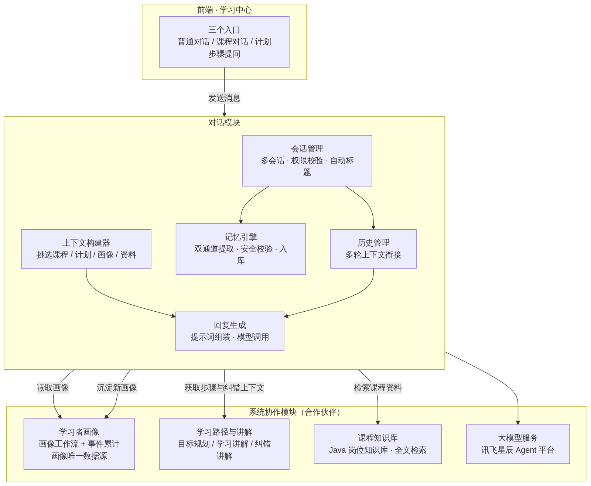
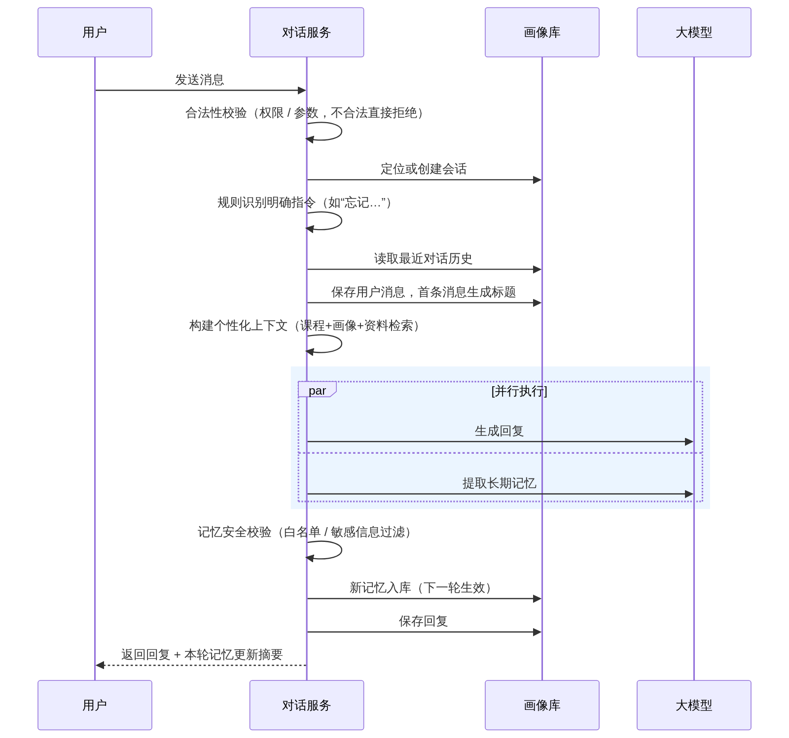
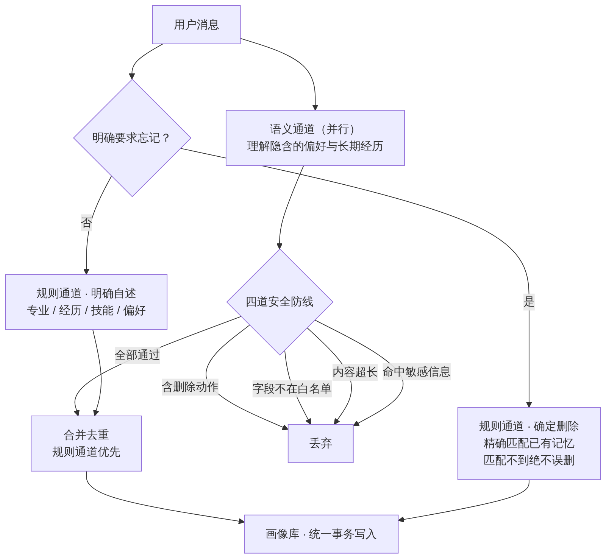
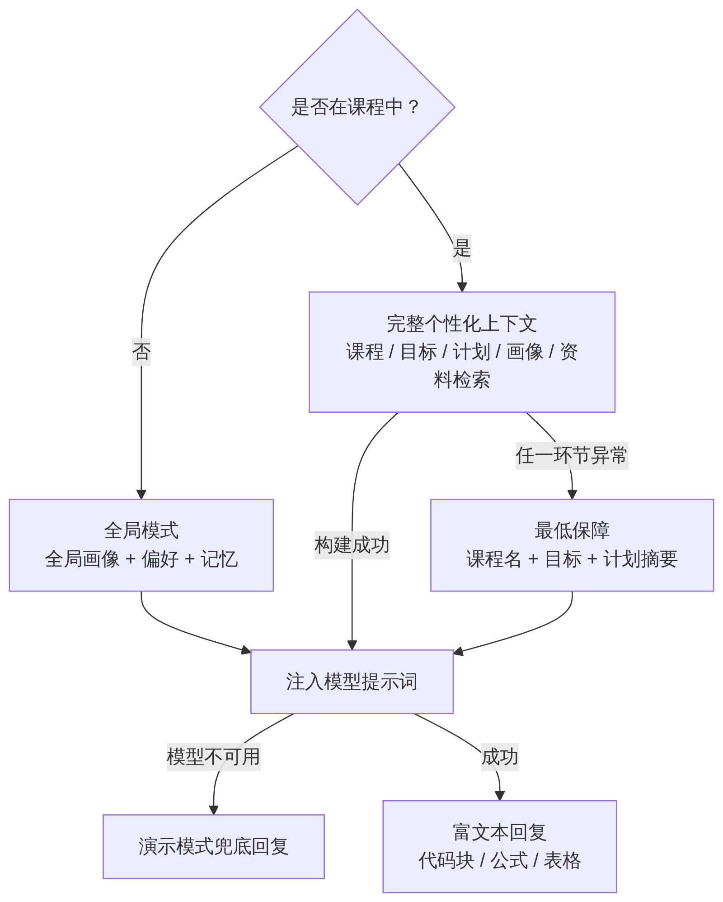

# 对话模块设计分享

> 论文正文格式版（无封面/目录/标题页）。Word 版见 `对话模块设计分享.docx`，配讲稿见 `对话模块分享讲稿.md`，示意图原图见 `share-assets/fig1-4.png`。

## 1  模块定位与职责边界

对话模块负责系统中的对话问答能力：一个对话服务统一承载全部对话场景，并在对话过程中完成画像的记忆采集。它在系统中有两个身份——用户侧的统一交互入口，以及学习者画像的主要采集入口。

系统背景：知行课径是个性化自适应学习与纠错系统，围绕"诊断—学习—检验—纠错"闭环提供目标澄清、能力图谱、测评、个性化路径、学习讲解、纠错讲解与画像更新能力；画像工作流与后端事件产生的信息最终统一沉淀到本地学习者画像库，由 SQLite 作为唯一画像真值。

模块边界刻意收敛为三条：不做多个独立聊天业务（如题目辅导、知识库问答各自一套），全部场景只有一个对话服务；不把整份画像塞给大模型，只做轻量的上下文挑选；不让大模型删除或重写画像，删除只走确定性规则，写入只能是白名单内的结构化字段。

## 2  设计思路与功能分层

模块功能自上而下分为四层，每层只依赖下一层；分层依据是离用户的距离，也对应实现顺序——先保证能聊（场景与会话），再保证聊得好（上下文个性化），最后让聊天反哺系统（记忆）。表 1 为功能总览，2.1 至 2.4 节逐层展开。

| 层次 | 名称 | 承担功能 |
|---|---|---|
| L1 | 场景层 | 普通对话 / 课程对话 / 计划步骤对话（就此提问） |
| L2 | 会话层 | 多会话管理 / 消息历史 / 自动标题 / 刷新恢复 |
| L3 | 上下文层 | 画像按需挑选 / 课程资料检索 / 步骤上下文注入 |
| L4 | 记忆层 | 双通道意图提取 / 安全校验 / 敏感过滤 / 统一落库 |

### 2.1  L1 场景层：三个对话入口，一个服务

| 场景 | 入口 | 上下文内容 |
|---|---|---|
| 普通对话 | 侧边栏新对话 | 全局画像 + 偏好 + 语义记忆（无课程） |
| 课程对话 | 课程页对话 | 课程名 / 目标 / 计划摘要 / 进度 + 本课程画像 + 课程资料 |
| 计划步骤对话 | 计划步骤"就此提问" | 课程上下文 + 步骤详情（阶段 / 知识点 / 目标 / 前置 / 难度）+ 课程资料 |

场景层定义模块对外的三个入口，以及各入口自动携带的上下文（表 2）。三个场景统一由同一个对话服务承载，用参数区分场景而不是按场景拆分服务——场景差异只是上下文不同，不是业务不同；对用户三个入口无感切换，对系统所有对话能力只有一份实现。

### 2.2  L2 会话层：多会话管理

会话层负责对话的组织与持久化，功能包括：

- 多会话：每次点"新对话"创建独立会话，支持每门课程多个会话，外加一个通用会话。
- 自动标题：由首条用户消息生成（超长截断），之后不随意改动。
- 历史恢复：页面刷新后按会话恢复全部历史；给大模型的只带最近若干轮，两个层级互不干扰。
- 权限安全：会话必须同时属于当前用户且课程匹配，否则一律拒绝，且不区分"不存在"和"无权限"，实现信息隐藏。

### 2.3  L3 上下文层：按需挑选 + 资料检索

上下文层决定回答的个性化程度——同一个问题，不同背景的用户得到不同深度的讲解。核心原则：**按需挑选，而不是全量加载**；上下文构建器只挑选当前真正有用的信息：

- 课程显示名（用户重命名后的名字，不把内部课程编号暴露给大模型）、学习目标、计划摘要与学习进度。
- 相关背景事实：只取活跃状态、按课程隔离过滤、限量，并转成自然语言，不暴露内部字段。
- 学习偏好：区分正向（偏好）与负向（避免）两个方向。
- 长期语义记忆：本课程与全局，限量注入。
- 课程资料检索：以"步骤标题 + 用户问题"为查询词，在课程知识库（如 Java 岗位知识库）中取最相关的几段，带就绪门控与用户、课程双重隔离。

### 2.4  L4 记忆层：安全的画像采集（核心亮点）

记忆层负责从对话中采集画像，目标是像主流 AI 产品的"记忆"功能一样，从自然对话中记住值得长期保存的信息：用户说"我会 Python、喜欢看代码示例"，之后的对话即可用上；说"以后回答简洁一点"，回答风格随之改变；说"忘记我做过 FastAPI"，对应记忆被确定性删除。当前实现是**职责分离的双路径**：删除始终由确定性规则同步执行；新增和更新优先由大模型做受约束的语义抽取，只有模型不可用或调用失败时才回退到确定性规则。

| 维度 | 确定性路径 | 语义路径 |
|---|---|---|
| 负责 | 删除；模型不可用时对明确自述做保守回退 | 理解隐含或复杂语义：偏好、经历、稳定风格 |
| 例子 | "忘记我做过 FastAPI" | "我更喜欢看代码示例，不太喜欢纯理论" |
| 能力边界 | 删除只匹配已有画像，不匹配就不动 | 只允许新增事实、设置偏好、添加记忆三类动作，永远没有删除权限 |

**语义通道的四道防线**——模型输出不可信，必须当作不可信输入处理：

1. 提示词约束：明确"记什么 / 不记什么 / 克制原则"（临时指令如"这次只回答一句"绝不入库），偏好只能是固定枚举，只输出结构化结果。
2. 动作白名单：逐条校验提取结果，只接受三类写入动作，删除动作直接丢弃。
3. 字段与长度校验：键名格式与内容长度上限，超限整项丢弃。
4. 敏感信息红线：联系方式、密码密钥、证件、银行卡、健康、政治宗教，命中即丢弃整项。

抽取结果经过指纹去重，经统一事务写入画像库，失败时事务回滚，变更日志与事件保留审计轨迹。删除采用按语义单元精确匹配的防误删设计——例如"忘记 Java"不会误删 JavaScript 相关记忆——匹配不到就不动。这一设计与系统的 AI 边界规范一致：模型不负责最终判分，也不以自由文本直接更新画像，一切画像变更都落在可追溯的结构化写入上。

**横切的可靠性设计**：课程、会话和计划步骤的关键归属校验前置到消息写入、画像更新和模型调用之前；生成回复与画像抽取并行执行，新写入记忆下一轮生效，而删除在构建本轮上下文前同步完成，因此删除会立即影响当前回复。删除和同一条消息中的其他新增信息可以同时生效，例如"忘记 Rust，对了我是数学专业的"会删除 Rust，同时保留数学专业。

## 3  个性化如何实现：从一句自述到一次不同的回答

个性化不是为每个学生重新训练一个模型，也不是把整份数据库原样拼进提示词。项目采用的是一条运行时闭环：**采集稳定信息 → 结构化存储 → 按场景筛选 → 注入生成上下文 → 下一轮继续更新**。因此，同一个问题在不同学习者、不同课程和不同计划步骤下，会得到不同的讲解深度、表达方式和知识范围。

### 3.1  个性化数据从哪里来

| 数据类型 | 例子 | 作用与隔离 |
|---|---|---|
| 学习者背景事实 | 已掌握 Python、数学专业、无 Java 基础 | 记录相对稳定的个人背景；全局事实可跨课程复用，课程背景只进入所属课程 |
| 学习偏好 | 优先代码示例、回答简洁、避免纯理论 | 控制回答和讲解方式；正向和负向偏好分别保留，并要求达到置信度阈值 |
| 长期语义记忆 | 做过电商后台、长期目标是转后端 | 记录跨轮对话仍有价值的经历、目标和学习情况；可全局或按课程保存 |
| 课程学习状态 | 课程目标、进度、知识点掌握度与置信度 | 决定课程内学什么、跳过什么、复习什么 |
| 本轮场景信息 | 当前课程、计划步骤、步骤目标、课程资料命中 | 只决定本轮问题的局部范围，不永久写入学习者画像 |

前四类信息会持久保存在本地 SQLite 学习者画像库中，本轮场景信息则随当前请求临时构建。聊天和学习计划都从同一份画像库读取，避免“对话记住了，但计划不知道”或不同课程互相污染。

### 3.2  画像是怎样被采集和写入的

以用户消息“我会 Python，更喜欢看代码示例，不太喜欢纯理论”为例，流程不是让模型自由改数据库，而是：

1. **成本闸门**：纯问题（如“什么是递归”）没有自述信号，不调用记忆抽取模型。
2. **语义抽取**：有“我 / 以前 / 喜欢 / 以后”等自述信号时，调用低温度模型，只要求输出 JSON；它可以提出 `set_fact`、`set_preference`、`add_memory` 三类动作。
3. **确定性校验**：逐条检查 action 白名单、键名格式、内容长度、偏好枚举、课程 scope 和敏感信息；单轮最多接受 12 条。
4. **统一结构化更新**：通过学习者画像服务写入背景事实、学习偏好或长期语义记忆，并记录事件与变更日志；不是让模型覆盖整份画像。
5. **删除单独处理**：用户说“忘记 / 删除 / 不再提”时，规则先匹配已有事实和记忆，精确命中才删除；模型永远没有删除权限。

回复生成和画像抽取并行，以免记忆能力拖慢回答。新增记忆通常从下一轮开始生效；删除在本轮上下文构建前完成，所以删除会立即生效。模型不可用时，新增和偏好会退回到保守的正则规则；模型成功返回空数组时，则尊重模型判断，不用正则制造误记忆。

### 3.3  画像如何变成提示词

对话上下文构建器不加载整份学习者画像，而是做一次轻量选择：

- 只取 active facts，当前课程的 `background:` 事实优先，并过滤其他课程背景；最多注入 6 条。
- 把 `skill:python`、`no_java` 等内部键转换成“已掌握 Python”“无 Java 基础”等自然语言，避免把数据库字段和内部课程 ID 暴露给模型。
- 只注入置信度至少 0.5 且偏好分数明显偏正或偏负的偏好；例如“优先使用代码示例”“避免纯理论优先”。
- 取全局和当前课程有效长期记忆的少量摘要；课程对话再附加课程名、目标、计划摘要、进度和当前步骤。
- 以“步骤标题 + 用户问题”检索当前课程资料，最多取最相关的 3 段，并执行用户、课程双重隔离。

最终注入模型的不是一堆 JSON，而是类似下面的上下文：

```text
当前课程：FastAPI 后端开发
学习目标：完成一个可部署的 Web 服务
学生背景：已掌握 Python；课程背景：有数据分析经验
学习偏好：优先使用代码示例；避免纯理论优先
当前计划步骤：依赖注入
课程资料参考：……
```

再与最近若干轮历史和当前问题一起交给回复模型。这样，个性化控制的是“讲什么、讲多深、怎么讲”，而不是篡改课程资料或绕过系统的事实校验。

### 3.4  个性化不只影响聊天，也影响学习计划

生成学习计划前，计划上下文会从同一份学习者画像中把知识点归为“已掌握 / 未知 / 需要复习”：掌握度高且置信度足够的内容压缩或跳过，掌握度低但有可靠证据的内容安排复习，没有证据的内容保持“未知”，不武断地当成“不会”。背景事实、学习偏好和长期记忆也会一并转成人话上下文，进入计划工作流。

因此个性化的结果可以形成闭环：对话中说“我会 Python” → 画像中保存技能事实 → 计划生成时压缩 Python 入门 → 课程对话中优先用 Python 代码解释新知识。

### 3.5  一个适合现场演示的完整例子

可以用同一个用户完成四步演示：

1. 先问“什么是依赖注入”，展示通用回答。
2. 再说“我会 Python，更喜欢看代码示例，不太喜欢纯理论”，展示画像更新摘要。
3. 再问“结合我的习惯解释依赖注入”，回答会带 Python/FastAPI 代码，并减少纯理论铺陈。
4. 最后说“忘记我会 Python”，再问同样问题，展示确定性删除与下一轮上下文变化；如果在课程里生成计划，还可以对比背景已知内容被压缩的效果。

这组演示同时说明了个性化的两个方向：**记住什么由结构化规则约束，使用什么由当前场景按需选择**。

## 4  模块结构示意

以下四张图从整体到局部展示对话模块：图 1 给出模块内部组件及其与系统内其他模块的交互关系；图 2 是一次对话请求的完整流程；图 3 展开记忆引擎的安全流水线；图 4 展示课程上下文、全局画像和降级路径如何汇合为最终提示词。



*图 1  对话模块内部组件与系统内其他模块的交互总览*

交互要点：对话模块是画像的读端与写端——读取由画像工作流与后端事件累计共同维护的学习者画像，并把聊天中提取的记忆回写进去；学习路径与讲解侧（目标规划、学习讲解、纠错讲解工作流）向对话提供当前步骤与纠错上下文，支撑"就此提问"式的追问；课程知识库（如 Java 岗位知识库）提供检索依据；大模型能力统一经讯飞星辰 Agent 平台提供。接口层只转发请求、不组织业务。



*图 2  一次对话请求的完整流程（时序）*

**两个关键顺序设计**：其一，先读历史、后存当前消息，保证当前消息在提示词中只出现一次，不会在历史和消息参数里各出现一份；其二，校验全部前置，任何校验失败都不会产生脏数据（空会话、幽灵画像或无效事件）。



*图 3  记忆意图提取与安全写入流水线*



*图 4  个性化上下文选择与降级路径*

## 5  关键设计决策与功能清单

| 决策 | 备选方案 | 选择理由 |
|---|---|---|
| 一个对话服务承载三场景 | 每场景一个聊天业务 | 场景差异只是上下文不同，不是业务不同；避免业务爆炸 |
| 记忆走结构化写入 | 大模型直接重写画像 | 模型输出不可信；结构化写入可校验、可审计，事务失败可回滚 |
| 删除只走规则通道 | 大模型判断删除 | 误删的代价远大于漏删；"忘记"是用户显式指令，应确定性执行 |
| 删除规则优先、写入语义主路径 | 规则和大模型无边界并行写入 | 删除等高危操作不依赖模型；复杂新增交给语义理解，模型失败仍可降级 |
| 回复与记忆提取并行 | 串行执行 | 记忆提取不增加回复延迟；新记忆下一轮生效，无需本轮串行 |
| 关键校验前置与权限三重校验 | 先产生数据再清理 | 归属校验在消息写入和模型调用前完成；统一拒绝响应实现信息隐藏 |

上述功能均已实现并有对应用例：记忆意图（新增、修改、删除事实，偏好，多课程隔离）、会话历史、越权访问拒绝、资料检索隔离、抽取超时后台落库等测试覆盖核心路径。综上，对话模块以三场景统一的会话服务、按需挑选的个性化上下文与安全记忆引擎构成——既是系统的统一对话入口，也是学习者画像的主要采集入口，让"对话中说的"变成"学习路径里用的"。
